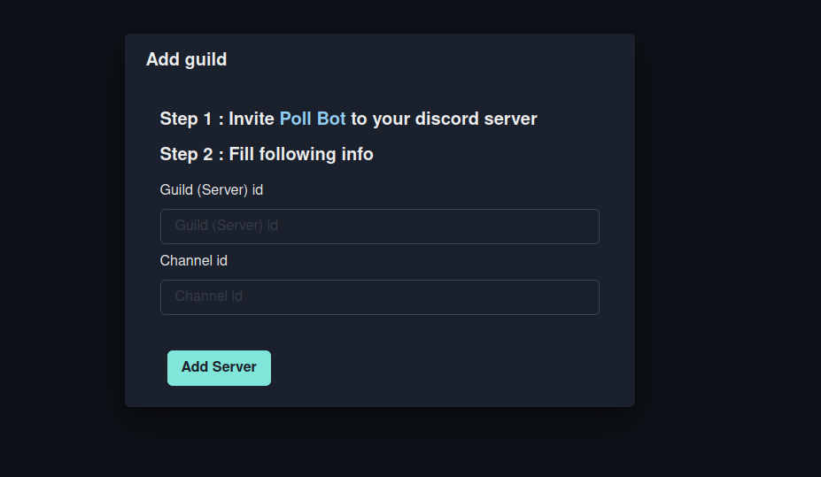
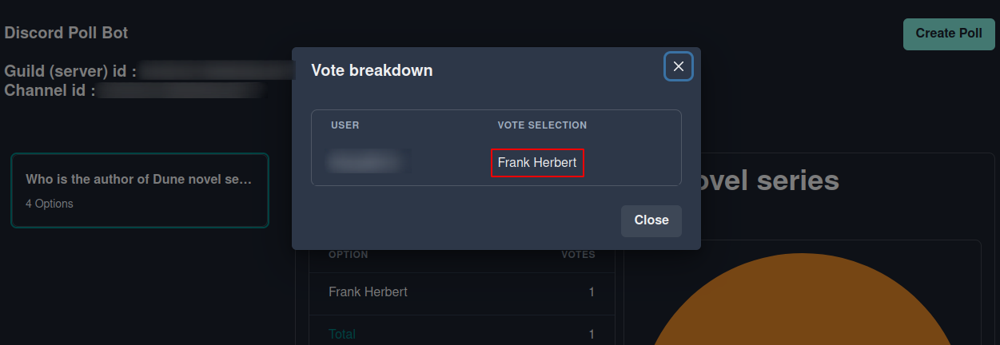

## Disco-Poll

### Discord polls on steroids

#### Create discord polls with a dashboard and view comprehensive data about the polls in realtime and graphical visualization

### Features

1. Get a detailed version of votes with user vise vote breakdown
2. Graphical visualization with pie diagram.
3. Restrict the poll to be a single selection or multi selection.
4. End and start the poll anytime you want.
5. Realtime vote data (unstable)

### Made with

1. [React](https://reactjs.org)
2. [Supabase](https://supabase.io)
3. [Fastify](https://www.fastify.io)
4. [Discord.js](https://discord.js.org)

### Hosted on

1. [Netlify](https://www.netlify.com)
2. [Heroku](https://heroku.com/)

### Developed for [Netlify Hashnode Hckathon](https://townhall.hashnode.com/netlify-hackathon)

### Scrennshots

 

 

 

 

 

